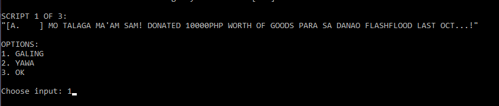
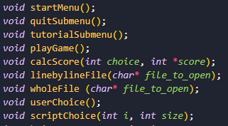
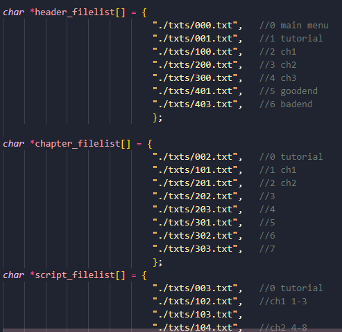

# Me and My Troll Farm - Project Documentation

**ME AND MY TROLL FARM: ROAD TO PROPAGANDA STARDOOM** is a text-based *Mad Libs-esque* game created in C. The prototype of a game does not tout to be a "solution" to existing social problems in the country; rather, it aims to produce a supplement of sorts to learning, particularly in the field on how disinformation works and spreads.


## Premise
>Justin Bulag is a fresh journalism graduate hired in an “advertising” firm. His first job is for a reelectionist mayoral candidate Sam A. Ilad-Lang, who seeks to rebrand her image for the upcoming 2069 midterm elections. In the rapidly advancing information war, it is up to Justin to either produce top-notch propaganda, at the expense of fooling the online public, or expose Sam’s fraudulent ways and reveal the truth.

## Mechanics
The *Mad Libs-esque* part means the player needs to choose a set of words to include in the script. Each word has a corresponding point. If we follow the tutorial above, *BEST* will receive 5 points, *WORST* with 0 points, and *MID* with 3 points.

The game is divided into 3 chapters. Chapter 2 and 3 have different routes depending on the score the player received during the previous chapter. To earn more points, players would have to pick words that are “favorable” to the client-candidate. 

Take note that in subsequent rounds, players will need to use “unfavorable” ones, but towards Ms. Ilad-Lang’s political opponents and dissidents. Likewise, the player receives lesser points if they refuse to cooperate. This includes choosing “unfavorable” words to Ms. Ilad-Lang or targeting “favorable” ones to her dissidents. Depending on Justin’s (or the player’s) performance, they would be able to reach either a *good* or a *bad ending*.



## Applied Concepts
### Functions
Multiple functions are used in the program. Since some lines of code will be repeated several times during the process (e.g. scores, opening files, choosing an input, etc.), it is much easier to just create a function and calling it.



* `void startMenu();`  - a start submenu for the game. User is given three options: (1) Start, (2) Tutorial, or (3) Quit. Each choice will lead to the `playGame()`, `tutorialSubmenu()` or `quitSubmenu()` functions. 
```C
void startMenu()
{
int whileStop=1;
while(whileStop){
    wholeFile (header_filelist[0]);

    //User choice  
    do {
    printf("\nChoose input: ");
    scanf("%d", &choice);      
    switch(choice){
        case 1:
            playGame();
            break;
        case 2:
            tutorialSubmenu();
            break;
        case 3:
            quitSubmenu();
            break;          
        default:
            printf("Invalid input. Try again.\n");  
            break;
	        };
	    } while(choice>3 || choice<1);
	}
}
```

- `void quitSubmenu();` - a quit submenu for the game. Inside the function, User is asked once more if they wish to exit. If they enter (1), the program terminates; otherwise, it loops back to `startMenu()`.
```C
void quitSubmenu(){
    int choice, whileStop=1;
    printf("\nAre you sure?\n");
    printf("1. Yes\n");
    printf("2. No\n");
    
    while(whileStop){
    do{
        printf("\nChoose input: ");
        scanf("%d", &choice);
            switch(choice){
                case 1:
                    exit(0);
                    break;
                case 2:
                    whileStop=0;
                    break;
                default:
                    printf("Invalid input. Try again.\n");
                }
        } while(choice>2 || choice<1);
    }
}
```

- `void tutorialSubmenu();` - opens the tutorial portion of the game. User is given a small script to work with. If they're finished, it loops back to `startMenu()`.
```C
void tutorialSubmenu(){
    wholeFile(header_filelist[1]);
    linebylineFile(chapter_filelist[0]);
    wholeFile(script_filelist[0]);
    userChoice();
    getchar();
    
    printf(">> TEAM LEADER ALICE: Trial lang 'to, ha? Later on, you'll tackle on far better things! [Press 'Enter' to go back]\n");
    score=0;
    getchar();
}
```

- `void playGame();` - as it says on the tin. Game is divided into three chapters, which follows similar instructions. CHAPTER 2 and CHAPTER 3 contain 3 different routes depending on the player's subtotal, hence the `if-else` portion. At the end of the game, user is prompted to either (1) play the game or (2) quit. Pressing (1) loops back to `startMenu()`, while (2) terminates the program.
```C
void playGame(){
    int a=2,b=1;

    //chapter 1
    i = 1, size = 4;
    wholeFile(header_filelist[2]);
    linebylineFile(chapter_filelist[1]);
    scriptChoice(i, size);
    printf("END OF CHAPTER 1");
    getchar();

    //chapter 2
    i = 4, size = 9;
    wholeFile(header_filelist[3]);
    if(score >=0 && score <=3)
        linebylineFile(chapter_filelist[3]);
    else if(score >= 3 && score <= 9)
        linebylineFile(chapter_filelist[4]);
    else
        linebylineFile(chapter_filelist[2]);
    scriptChoice(i, size);
    printf("END OF CHAPTER 2");
    getchar();

    //chapter 3
    i = 9, size = 19;
    wholeFile(header_filelist[4]);
    if(score >=0 && score <=8)
        linebylineFile(chapter_filelist[6]);
    else if(score>=9 && score<=24)
        linebylineFile(chapter_filelist[7]);
    else
        linebylineFile(chapter_filelist[5]);
    scriptChoice(i, size);
    printf("END OF CHAPTER 3");
    getchar();

    //ending
    if(score >=0 && score <=44){
        linebylineFile(ending_filelist[1]);
        wholeFile(header_filelist[6]);
    }
    else{
        linebylineFile(ending_filelist[0]);
        wholeFile(header_filelist[5]);
    }
    getchar();

    printf("FINAL SCORE: %d\n", score);
    getchar();

    printf("1. Play again?\n");
    printf("2. Quit\n");
    do {
    printf("\nChoose input: ");
    scanf("%d", &choice);      
    
    switch(choice){
        case 1:
            break;
        case 2:
            exit(0);
            break;          
        default:
            printf("Invalid input. Try again.\n");  
            break;
        };
    } while(choice>2 || choice<1);
    score = 0;
}
```

- `void calcScore(int choice, int *score);` - calculates the score according the user's input with corresponding comments. If user chooses option (1), they receive 5 points. Option (2) results in 0 points. Option (3) gets 3 points. It will be constantly added throughout the game. 
```C
void calcScore(int choice, int *score) {
    switch(choice){
    case 1:
        *score+=5;
        printf("\n>> TEAM LEADER ALICE: Perfect! Keep it up! [...]\n");
        getchar();
        printf("Current score: %d\n", *score);
        break;
    case 2:
        printf("\n>> TEAM LEADER ALICE: Remember your job. make Ma'am SAM good! Anong ginawa mo?! [...]\n");
        getchar();
        printf("Current score: %d\n", *score);
        break;
    case 3:
        *score+=3;
        printf("\n>> TEAM LEADER ALICE: Good, but it could be better. [...]\n");
        getchar();
        printf("Current score: %d\n", *score);
        break;
    default:
        printf("invalid input. Try again\n");
        break;
    };  
}
```

- `void linebylineFile(char* file_to_open);` - files will be printed one line at a time. User has to press 'enter' to go to the next line. This is applied primarily to the story portions of the game.
```C
void linebylineFile(char* file_to_open){
    FILE *playfile;
    char info[1000];
    
    playfile = fopen(file_to_open, "r");
    while(fgets(info, sizeof(info), playfile) != NULL) {
        printf("%s", info);
        fflush(stdin);
        getchar();
    };
    fclose(playfile);
}
```

- `void wholeFile (char* file_to_open);` - entire text file will be printed. This is applied to the script and menu/submenu portions of the game.
```C
void wholeFile(char* file_to_open){
    FILE *playfile;
    char info[1000];
    playfile = fopen(file_to_open, "r");
    while(fgets(info, sizeof(info), playfile) != NULL) {
        printf("%s", info);
    };
    fclose(playfile);
}
```

- `void userChoice();` - where user inputs their choice, which is then dumped through the `calcScore()` function. Only used once for the tutorial portion in the game, since there's only one script in there.
```C
void userChoice(){
    do {
    printf("\nChoose input: ");
    scanf("%d", &choice);
    calcScore(choice, &score);
    } while(choice>3 || choice<1);
}
```

- `void scriptChoice(int i, int size);` - similar to `userChoice()`, but now contains the `wholeFile()` and `userChoice()`, and is now enclosed in a `for()` loop. Used in chapters during gameplay because multiple scripts will be handled by the player. `i` refers to the array index, `size` refers to the number of scripts to go through before function terminates.
```C
void scriptChoice(int i, int size){
    for(i; i < size; i++){
    wholeFile(script_filelist[i]);
    userChoice();
    getchar();
    }
}
```

### Arrays
Accesing the file using variables and strings may become messy in the long run. Instead, file names are enclosed in a 1D array, and will be accessed using their respective indices.



-`char *header_filelist[]` - encloses text files that contain headers inside (e.g. TUTORIAL, CHAPTER 1, etc.)
```C
char *header_filelist[] = {
                            "./txts/000.txt",   //0 main menu
                            "./txts/001.txt",   //1 tutorial
                            "./txts/100.txt",   //2 ch1
                            "./txts/200.txt",   //3 ch2
                            "./txts/300.txt",   //4 ch3
                            "./txts/401.txt",   //5 goodend
                            "./txts/403.txt",   //6 badend
                            };
```

- `char *chapter_filelist[]` - encloses text files that contain chapter files (e.g. dialog for CHAPTER 1, etc.). The subtotal of the score determines the route for CHAPTER 2 and CHAPTER 3, which is why there are three different files for those chapters.
```C
char *chapter_filelist[] = {
                            "./txts/002.txt",   //0 tutorial
                            "./txts/101.txt",   //1 ch1
                            "./txts/201.txt",   //2 ch2
                            "./txts/202.txt",   //3
                            "./txts/203.txt",   //4
                            "./txts/301.txt",   //5 ch3
                            "./txts/302.txt",   //6
                            "./txts/303.txt",   //7
                            };
```

- `char *script_filelist[]` - encloses text files that contain the script for each chapter. CHAPTER 1 has 3 scripts; CHAPTER 2 has 5, and CHAPTER 3 has 10.
```C
char *script_filelist[] = {
                            "./txts/003.txt",   //0 tutorial
                            "./txts/102.txt",   //ch1 1-3
                            "./txts/103.txt",
                            "./txts/104.txt",   //ch2 4-8
                            "./txts/204.txt",
                            "./txts/205.txt",  
                            "./txts/206.txt",
                            "./txts/207.txt",
                            "./txts/208.txt",
                            "./txts/304.txt",   //ch3 9-18
                            "./txts/305.txt",
                            "./txts/306.txt",
                            "./txts/307.txt",
                            "./txts/308.txt",
                            "./txts/309.txt",
                            "./txts/310.txt",
                            "./txts/311.txt",
                            "./txts/312.txt",
                            "./txts/313.txt",
                            };
```

- `char *ending_filelist[]` - encloses text files that contain the endings. There are only 2 unique endings to the game.
```C
char *ending_filelist[] = {
                            "./txts/400.txt",   //0 goodend
                            "./txts/402.txt",   //1 badend
                            };
```

### Pointers
There are two instances where pointers are used: creating the `calcScore()` function and when opening a file.

 function using a pointer")

During initial testing, `calcScore()` was not able to change the score's value when outside the function, so a pointer has to be used to permanently alter the score after the user's input. This is also known as `pass-by-reference`.

Meanwhile, pointers are used in file handlings to determine its position when opening files. 

### File Handling
There is extensive use of files handling and manipulation, since it stores all the text needed for the game. There are two functions dedicated specifically for it: `linebylineFile()` and `wholeFile()` (see [[README#Functions]]). 

While they are both similar (e.g. using the `fopen()`, `fgets()` and `fclose()` functions to open, print, and close the textfiles), there are some very small differences. `linebylineFile()` only prints one line at a time until the 'Enter' key is pressed. Since it is primarily used for the dialog portions of the game, it makes it a little interactive for the user. Meanwhile `wholeFile()` prints the entire text file, and is used for the headers and scripts.

 and wholeFile() functions")
